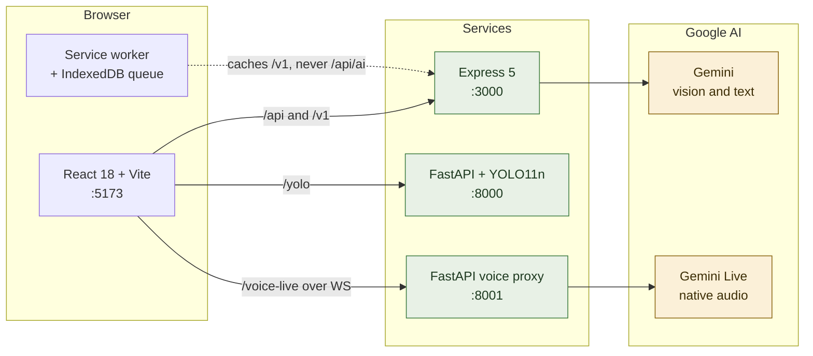
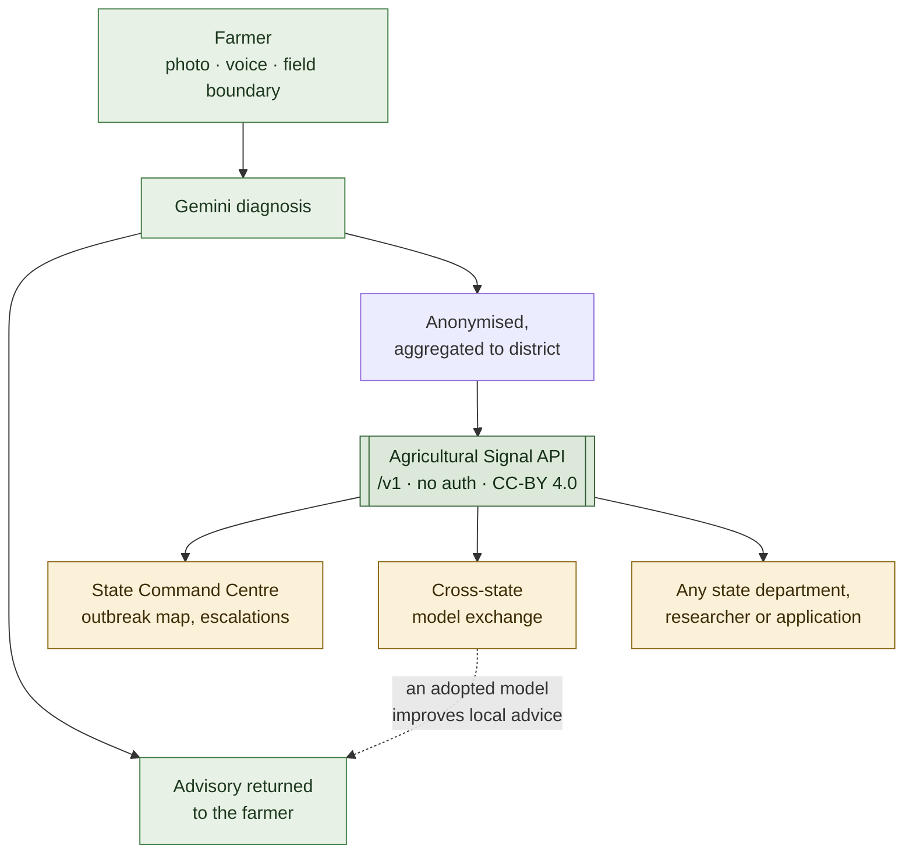
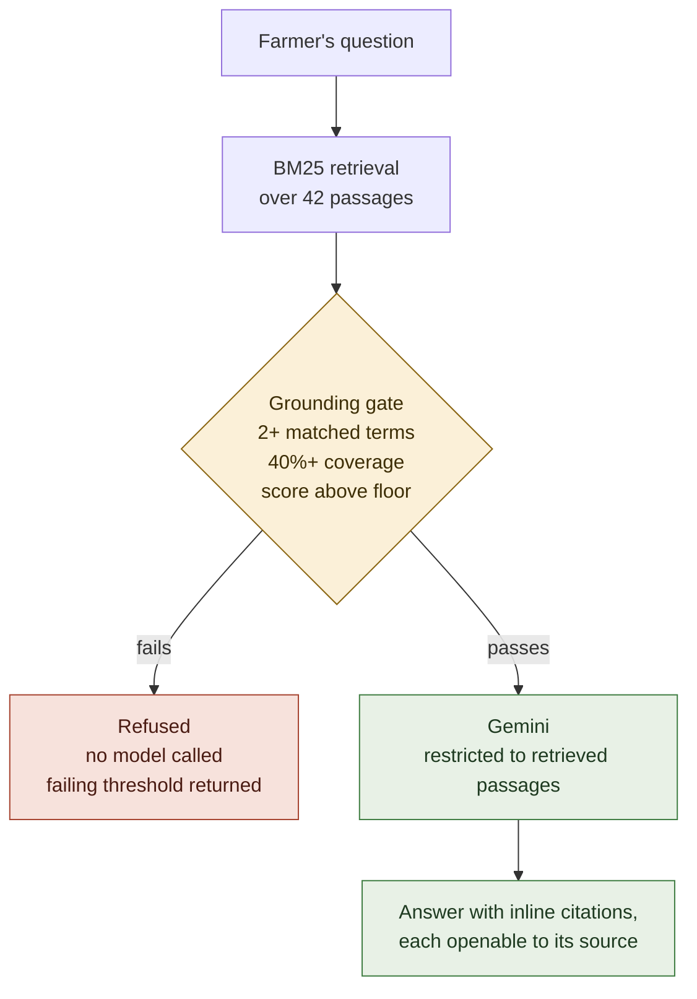
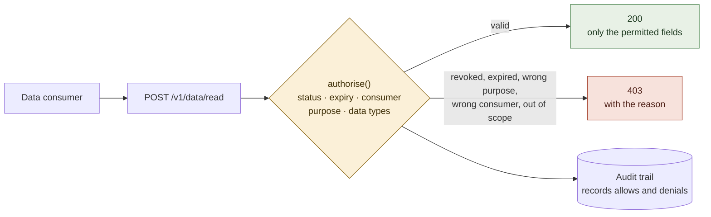
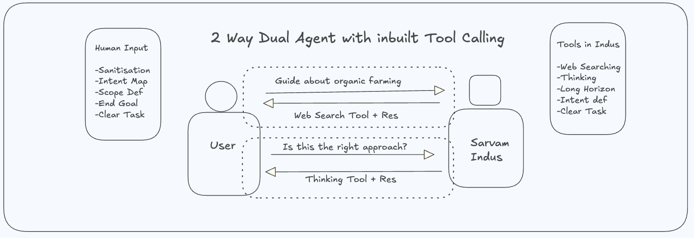
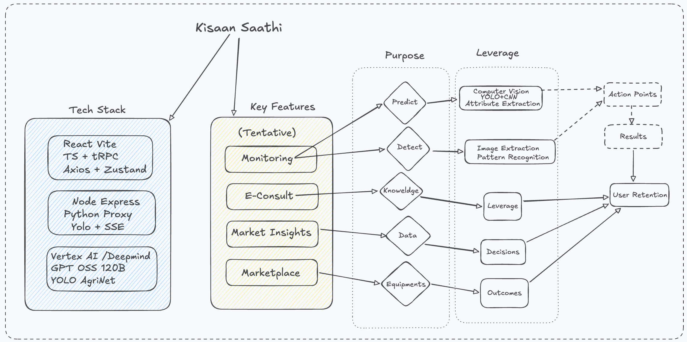
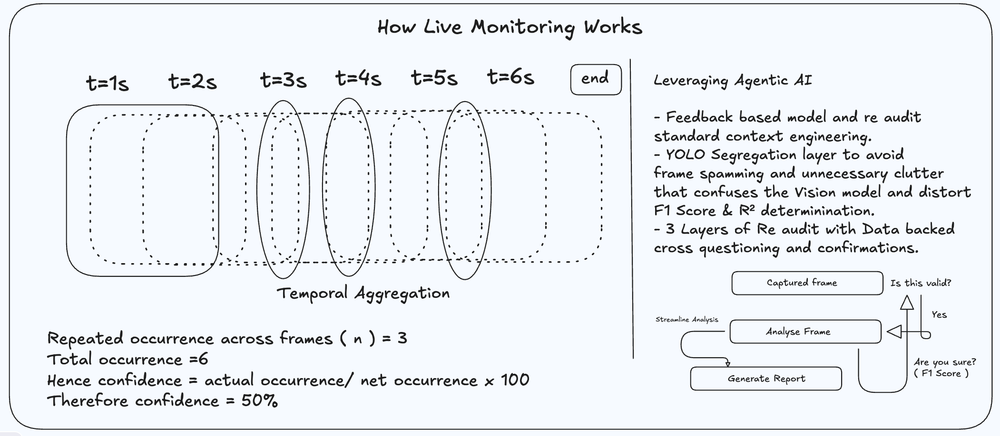
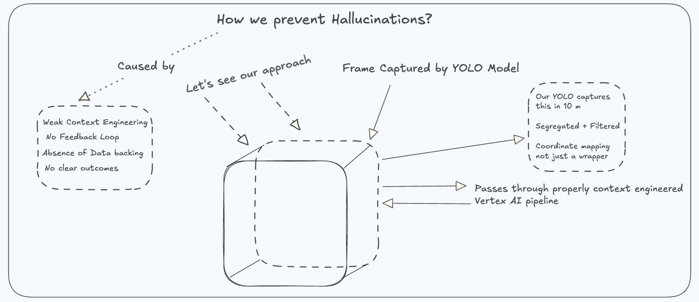

# Kisan AI

An interoperable digital agriculture network for India. Farmers get AI crop diagnosis and
voice advisory in 20 Indian languages; the same diagnoses, anonymised and aggregated,
become a live district-level crop surveillance picture for state agriculture departments —
served over an open, unauthenticated API.

Built for **Build with AI: Code for Communities**, Google Cloud + GDG India.

---

## Quick start

The fastest path is the stepped launcher (macOS and Windows/Git Bash). It installs
dependencies, sets up `.env`, optionally pulls the local LLaVA model through Ollama,
and starts every service:

```bash
./start.sh
```

Manual path — two services, two terminals.

```bash
cd backend && npm install && npm start      # http://localhost:3000
```

```bash
cd frontend && npm install && npm run dev   # http://localhost:5173
```

Then open <http://localhost:5173> and the API console at
<http://localhost:3000/v1/docs>.

**API keys.** Copy `.env.example` to `.env` and fill in `GEMINI_API_KEY`, `GROQ_API_KEY`
and `WEATHER_API_KEY`. Most of the app runs without them — the surveillance API, field
boundaries, consent layer, retrieval and the advisory refusal path all work with no keys at
all. A Gemini key is needed only for generated text and the live voice consult.

**Full stack with YOLO and the voice proxy:**

```bash
docker-compose up --build
```

---

## What it does

| Route | Feature |
|---|---|
| `/` | Voice-first entry — one large button opens a spoken consult in 20 Indian languages |
| `/monitor` | Crop, soil, thermal and field diagnosis from a photo. Captures taken without signal are queued on the device and analysed when connectivity returns |
| `/consult` | Real-time speech-to-speech agricultural consultation via Gemini Live |
| `/advisory` | Retrieval-grounded advisory. Every claim carries a citation you can open and read; when the corpus cannot support an answer the request is **refused before any model call** |
| `/fields` | Draw your plot boundary on a map. Stored as GeoJSON, with area in hectares and a vegetation trend |
| `/consent` | DEPA-aligned data rights. See who can read your data, revoke in one tap, and read the full access log |
| `/command` | State and ministry view — district outbreak map across 29 states, escalation queue, and a cross-state advisory model registry |
| `/market` | Mandi prices and market analysis |
| `/farming` | Regenerative technique advisor with government subsidy lookup |

---

## Architecture

Four services. The frontend proxies `/api`, `/v1`, `/yolo` and the WebSocket paths, so
everything is same-origin in both development and Docker.

| Service | Port | Stack | Responsibility |
|---|---|---|---|
| `frontend/` | 5173 | React 18, TypeScript, Vite, Tailwind CSS 4 | UI, offline queue, service worker |
| `backend/` | 3000 | Node, Express 5, strict TypeScript (runs via tsx) | Public `/v1` API, AI proxying, retrieval, consent, fields |
| `yolo/` | 8000 | FastAPI, Ultralytics YOLO11n | Object detection on video frames |
| `voice-service/` | 8001 | FastAPI, websockets | Gemini Live audio proxy |



### The two-sided design



The dashboard has no privileged access path. It reads the same public endpoints any state
department, researcher or third-party application would call.

---

## The public API

24 routes, unauthenticated, CC-BY 4.0. Interactive console at `/v1/docs`, OpenAPI 3.0
specification at `/v1/openapi.json`.

```bash
curl http://localhost:3000/v1/surveillance/districts?state=PB
curl "http://localhost:3000/v1/knowledge/search?q=yellow%20stripes%20on%20wheat%20leaves"
curl -X POST http://localhost:3000/v1/advisory \
  -H "Content-Type: application/json" \
  -d '{"question":"My wheat has yellow stripes on the leaves"}'
```

| Group | Routes |
|---|---|
| Surveillance | `/v1/surveillance/{states,districts,alerts}` |
| Model exchange | `/v1/models`, `/v1/models/:id` |
| Knowledge | `/v1/knowledge`, `/v1/knowledge/search`, `POST /v1/advisory` |
| Consent | `/v1/consent`, `/v1/consent/:id/revoke`, `/v1/consent/audit`, `POST /v1/data/read` |
| Fields | `/v1/fields`, `/v1/fields/:id/vegetation` |
| Explainability | `/v1/explain/rules`, `POST /v1/explain` |
| Meta | `/v1/`, `/v1/docs`, `/v1/openapi.json` |

---

## Design decisions

**Retrieval before generation.** The advisory layer searches a document corpus first and
may use only what it retrieved, citing each claim. If retrieval is too weak — fewer than
two matched terms, under 40% question coverage, or below a score floor — no model is called
and the refusal states which threshold failed. A wrong crop advisory costs a farmer a
season, so the system is built to fail loudly rather than answer confidently from nothing.



**BM25, not embeddings.** Lexical retrieval needs no API key, is deterministic, and is
explainable: every result shows the query terms that matched it. A cosine similarity of
0.81 tells a farmer nothing.

**Consent is enforced, not recorded.** Every read of farm data passes an authorisation
check against the consent artefact — status, expiry, consumer, purpose and the exact data
types requested. Revoking changes the outcome of the next request.



**The India map is a cartogram.** Each state is a hex tile positioned to approximate its
place in the country. Drawing contested borders incorrectly carries real legal risk in
India; a cartogram carries the agricultural signal without asserting a boundary, and needs
no geo files or map key.

**Offline is a first-class path.** A farmer photographs a diseased crop standing in a
field, which is exactly where signal is worst. Captures go to IndexedDB immediately and
replay when connectivity returns. Images are downscaled before sending — a 387 KB phone
frame becomes 24 KB, or 7 KB under data saver.

**Advisories show their working.** Threshold rules are evaluated in code, not by the model.
Each recommendation lists the measurements behind it and the threshold each one crossed, so
a farmer can check it against their own field and disagree when an input is wrong.

---

## Data provenance

Read this before evaluating any number in the interface.

**Real:** district names, state agro-climatic zones (the 15-zone NARP classification), crop
and pest associations, field boundaries you draw, and every API response shape.

**Simulated:** the surveillance metrics — outbreak index, advisory reach, soil and water
stress — and the field vegetation series. These model the shape of the live feed. **They are
not observations from ICAR, ISRO or any government source**, and every page and API response
that carries them says so.

**Curated draft:** the advisory corpus is written for this project. It is not extracted from
ICAR, KVK or state agricultural university publications, and each document carries a
verification link to official portals.

The response schemas are the stable contract. Connecting a live data source replaces the
values and changes nothing else, so anything built against this API keeps working.

---

## Tech stack

**Frontend** — React 18, TypeScript, Vite 5, Tailwind CSS 4, React Router, Framer Motion,
Recharts, Leaflet.

**Backend** — Node.js, Express 5 (ESM), `ws` for WebSockets, Razorpay.

**AI** — Google Gemini (`gemini-2.0-flash` for vision and text,
`gemini-2.5-flash-native-audio` for live speech-to-speech), Groq
(`llama-3.1-8b-instant`, `openai/gpt-oss-20b`, `whisper-large-v3-turbo`), Ultralytics
YOLO11n for object detection, and **local vision via Ollama (LLaVA)** — when the local
model is present it answers first and Gemini becomes the declared fallback.

**Local-first vision policy.** Vision endpoints try Ollama before any cloud call. Every
response names the provider that produced it; a degradation is carried in the response as
`degraded: true` with a `fallbackReason`. There are no silent fallbacks and no fabricated
results anywhere in the pipeline — if both providers fail the API says so explicitly.

**Backend language.** The backend is written end-to-end in strict TypeScript
(`strict` + `noUncheckedIndexedAccess`, no `any`). `npm run typecheck` must stay clean.

**Retrieval** — Okapi BM25, implemented directly. No embedding model or vector database.

**Maps** — Leaflet with Esri World Imagery and OpenStreetMap tiles. No API key required.

**Multilingual** — 20 Indian languages via Google Translate, with Gemini Live handling
spoken consultation in the farmer's own language.

---

## Architecture research

Design documents produced while planning the system. These describe the intended
architecture and are not a line-by-line record of what is currently built.

### Agent-to-agent communication


### System overview


### Live monitoring
Temporal aggregation for real-time frame analysis with confidence scoring.


### Hallucination prevention
Multi-layer validation through context engineering.


### Image analysis pipeline
CNN and YOLO pipeline for soil, heatmap and drone imagery.


---

## Known limitations

- **No persistence.** Fields, consent artefacts and diagnoses are held in process memory
  and clear on restart. The interfaces are shaped for Firestore; substituting it changes no
  response shape.
- **No satellite integration.** The vegetation chart is a labelled placeholder. Field
  boundaries are already stored as GeoJSON polygons, which is what Google Earth Engine takes
  as a region of interest.
- **No automated tests.** Behaviour has been verified by hand against the running system.
- **Free tile services.** Esri and OpenStreetMap tiles suit development and demonstration.
  Production use at scale needs a commercial provider, self-hosted tiles, or ISRO Bhuvan
  services.

---

## Repository

```
start.sh          stepped launcher: deps, env, optional LLaVA pull, all services
backend/          Express API in strict TypeScript, retrieval, consent, fields, surveillance
  lib/            surveillance, retrieval, consent, fields, explainability, ollama, apiDocs
  routes/         v1 (public API), ai + aiVision (local-first vision), farming, weather, payment, ws
  data/           national grid, advisory corpus
frontend/
  src/pages/      Home, Monitoring, Consult, Market, Fields, Advisory, Consent, Command
  src/components/ command, advisory, fields, offline, monitoring
  src/api/        typed client for the public API
  public/         service worker, manifest, offline page
yolo/             FastAPI + YOLO11n detection service
voice-service/    FastAPI Gemini Live audio proxy
research/         architecture design documents
```
